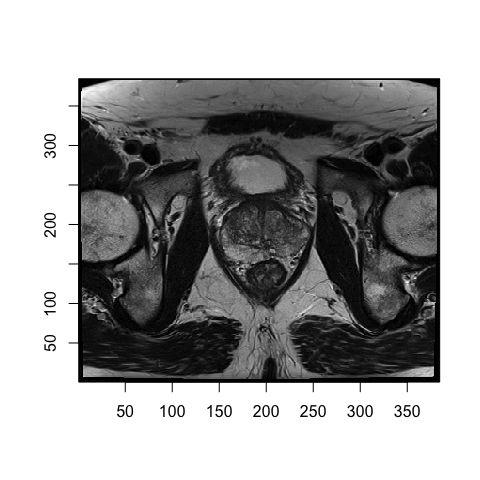
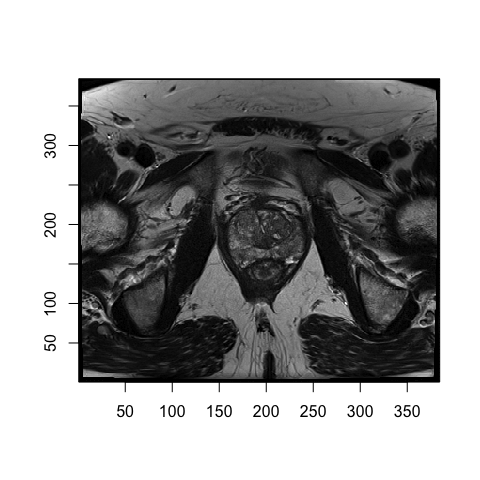
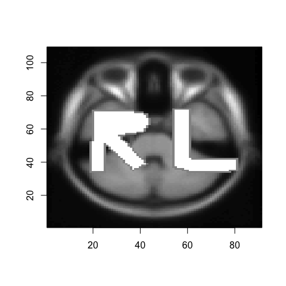
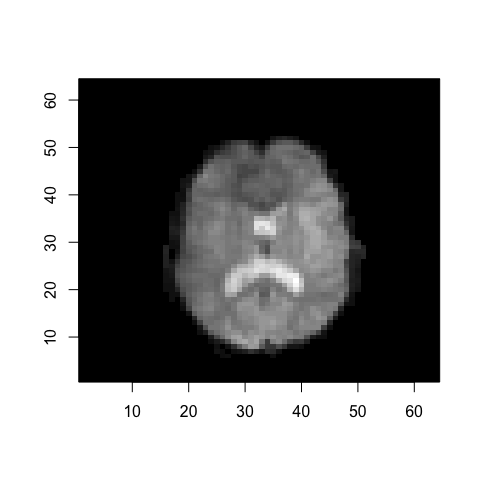

<!-- README.md is generated from README.Rmd. Please edit that file -->

# radtools

[](https://cran.r-project.org/web/packages/radtools/index.html)
[](https://cran.r-project.org/web/packages/radtools/index.html)

`radtools` is an R package that provides utilities to explore images in
the two leading medical image formats:
[DICOM](https://www.dicomstandard.org/) and
[NIfTI](https://nifti.nimh.nih.gov/). This documentation demonstrates
how to read image data into R, extract data and metadata, and view
images.

# Installation

Radtools is on [CRAN](https://cran.r-project.org/package=radtools).

To install from within R:

``` r
install.packages("radtools")
```

You can install the development version from GitHub with:

``` r
# install.packages("devtools")
devtools::install_github("pamelarussell/radtools")
```

# Image file formats

## DICOM

DICOM (Digital Imaging and Communication in Medicine) is a standard for
management of medical images and image metadata. The [DICOM
standard](https://www.dicomstandard.org/current/) specifies a file
format definition. Each DICOM file includes optional pixel data and
embedded metadata. Typically, each DICOM file contains one
two-dimensional image slice. Radtools also supports DICOM files that do
not contain pixel data.

DICOM metadata is embedded in each file and allows image series to be
reconstructed from multiple files via shared metadata identifying the
patient, etc. DICOM files can be analyzed individually, or a directory
containing an entire image series can be analyzed as one
three-dimensional image.

## NIfTI

NIfTI (Neuroimaging Informatics Technology Initiative) format is an
adaptation of the previous ANALYZE format that solves several challenges
with the older format. NIfTI images can be a single file containing the
image and metadata (`.nii`) or pair of files storing the image and
metadata separately (`.hdr`/`.img`), and can be compressed. Image data
can have up to seven dimensions. The first three dimensions are reserved
for spatial dimensions and the optional fourth dimension defines time
points. Unlike DICOM format, the NIfTI format specifies a constant-size
header with a fixed set of metadata attributes.

[This article](https://brainder.org/2012/09/23/the-nifti-file-format/)
provides an excellent introduction to NIfTI-1 format.

Our package supports NIfTI-1 format. The recently developed NIfTI-2 is
very similar to NIfTI-1, and permits storage of more datapoints in each
dimension. NIfTI-2 is not bitwise compatible with NIfTI-1. We will add
support for NIfTI-2 if demand exists. [This
article](https://brainder.org/2015/04/03/the-nifti-2-file-format/)
provides more background on the differences between NIfTI-1 and NIfTI-2.

# Import the package

``` r
library(radtools)
```

# Reading data from files

## DICOM

The `read_dicom` function reads a DICOM dataset from a single file or a
directory containing multiple slices. The returned value is a list with
attributes `hdr` and `img`, each with an element for each slice of the
image.

Read a single slice from one `.dcm`
file:

``` r
dicom_data_2d <- read_dicom("~/Dropbox/radtools_vignette_data/prostate/000008.dcm")
names(dicom_data_2d)
#> [1] "hdr" "img"
```

Read a 3D image from a directory containing one `.dcm` file per
slice:

``` r
dicom_data_3d <- read_dicom("~/Dropbox/radtools_vignette_data/prostate/")
names(dicom_data_3d)
#> [1] "hdr" "img"
```

## NIfTI

NIfTI format uses one `.nii` file or two files (`.hdr` and `.img`) to
capture an entire image series. The files can be gzipped or not.

The `read_nifti1` function handles any of these cases, and returns a
list containing one element of class `nifti`.

Read a 3D NIfTI image from `.hdr` and `.img`
files:

``` r
nifti_data_3d <- read_nifti1("~/Dropbox/radtools_vignette_data/avg152T1_LR_nifti")
```

Read a 4D NIfTI image from a `.nii.gz`
file:

``` r
nifti_data_4d <- read_nifti1("~/Dropbox/radtools_vignette_data/filtered_func_data.nii.gz")
```

# Extracting image metadata

## Generic metadata functions

Get image dimensions or number of slices:

``` r
img_dimensions(dicom_data_2d)
#> Warning in oro.dicom::create3D(img_data): ImagePositionPatient is moving in
#> more than one dimension.
#> [1] 384 384   1
num_slices(dicom_data_2d)
#> [1] 1
img_dimensions(dicom_data_3d)
#> Warning in oro.dicom::create3D(img_data): ImagePositionPatient is moving in
#> more than one dimension.
#> [1] 384 384  19
num_slices(dicom_data_3d)
#> [1] 19
img_dimensions(nifti_data_3d)
#> [1]  91 109  91
num_slices(nifti_data_3d)
#> [1] 91
img_dimensions(nifti_data_4d)
#> [1]  64  64  21 180
num_slices(nifti_data_4d)
#> [1] 21
```

A typical DICOM dataset will only use a subset of the available metadata
attributes, while NIfTI headers always include the same set of
attributes. Get the actual metadata attributes for a dataset:

``` r
header_fields_dicom <- header_fields(dicom_data_3d)
head(header_fields_dicom)
#> [1] "AccessionNumber"          "AcquisitionDate"         
#> [3] "AcquisitionMatrix"        "AcquisitionNumber"       
#> [5] "AcquisitionTime"          "AdditionalPatientHistory"
header_fields(nifti_data_3d)
#>  [1] ".Data"          "sizeof_hdr"     "data_type"      "db_name"       
#>  [5] "extents"        "session_error"  "regular"        "dim_info"      
#>  [9] "dim_"           "intent_p1"      "intent_p2"      "intent_p3"     
#> [13] "intent_code"    "datatype"       "bitpix"         "slice_start"   
#> [17] "pixdim"         "vox_offset"     "scl_slope"      "scl_inter"     
#> [21] "slice_end"      "slice_code"     "xyzt_units"     "cal_max"       
#> [25] "cal_min"        "slice_duration" "toffset"        "glmax"         
#> [29] "glmin"          "descrip"        "aux_file"       "qform_code"    
#> [33] "sform_code"     "quatern_b"      "quatern_c"      "quatern_d"     
#> [37] "qoffset_x"      "qoffset_y"      "qoffset_z"      "srow_x"        
#> [41] "srow_y"         "srow_z"         "intent_name"    "magic"         
#> [45] "extender"       "reoriented"
```

The `header_value` function returns the attribute value for a given
header attribute. If the dataset is a DICOM dataset with multiple
slices, it returns a vector of values across slices. NIfTI datasets do
not have slice-specific metadata.

``` r
header_value(dicom_data_2d, "SliceLocation")
#> [1] 7.53097
header_value(dicom_data_3d, "SliceLocation")
#>  [1]  28.53097  22.53097   1.53097  25.53097  19.53097  16.53097  13.53097
#>  [8]  10.53097   7.53097  -1.46903  -4.46903  -7.46903 -10.46903 -13.46903
#> [15] -16.46903 -19.46903 -22.46903 -25.46903   4.53097
header_value(nifti_data_3d, "dim_")
#> [1]   3  91 109  91   1   1   1   1
header_value(nifti_data_4d, "dim_")
#> [1]   4  64  64  21 180   1   1   1
```

## DICOM-specific metadata functions

Each DICOM file has its own header containing metadata for one slice.

Get the metadata for all slices as a matrix, where rows are attributes
and columns are slices:

``` r
dicom_metadata_matrix <- dicom_header_as_matrix(dicom_data_3d)
kable(dicom_metadata_matrix[1:10, 1:6])
```

| group | element | name                       | code | slice\_1                                                         | slice\_2                                                         |
| :---- | :------ | :------------------------- | :--- | :--------------------------------------------------------------- | :--------------------------------------------------------------- |
| 0002  | 0000    | GroupLength                | UL   | 196                                                              | 196                                                              |
| 0002  | 0001    | FileMetaInformationVersion | OB   |                                                                 |                                                                 |
| 0002  | 0002    | MediaStorageSOPClassUID    | UI   | 1.2.840.10008.5.1.4.1.1.4                                        | 1.2.840.10008.5.1.4.1.1.4                                        |
| 0002  | 0003    | MediaStorageSOPInstanceUID | UI   | 1.3.6.1.4.1.14519.5.2.1.7307.2101.420604470287150790758949858236 | 1.3.6.1.4.1.14519.5.2.1.7307.2101.192741832082705219013781007567 |
| 0002  | 0010    | TransferSyntaxUID          | UI   | 1.2.840.10008.1.2.1                                              | 1.2.840.10008.1.2.1                                              |
| 0002  | 0012    | ImplementationClassUID     | UI   | 1.2.40.0.13.1.1.1                                                | 1.2.40.0.13.1.1.1                                                |
| 0002  | 0013    | ImplementationVersionName  | SH   | dcm4che-1.4.31                                                   | dcm4che-1.4.31                                                   |
| 0008  | 0005    | SpecificCharacterSet       | CS   | ISO\_IR 100                                                      | ISO\_IR 100                                                      |
| 0008  | 0008    | ImageType                  | CS   | ORIGINAL PRIMARY M NORM DIS2D                                    | ORIGINAL PRIMARY M NORM DIS2D                                    |
| 0008  | 0012    | InstanceCreationDate       | DA   | 20030816                                                         | 20030816                                                         |

Many metadata attributes will be identical for all slices. Get a list of
these contstant attributes and their values:

``` r
const_attributes <- dicom_constant_header_values(dicom_data_3d)
head(const_attributes)
#> $GroupLength
#> [1] 196
#> 
#> $FileMetaInformationVersion
#> [1] "\001"
#> 
#> $MediaStorageSOPClassUID
#> [1] "1.2.840.10008.5.1.4.1.1.4"
#> 
#> $TransferSyntaxUID
#> [1] "1.2.840.10008.1.2.1"
#> 
#> $ImplementationClassUID
#> [1] "1.2.40.0.13.1.1.1"
#> 
#> $ImplementationVersionName
#> [1] "dcm4che-1.4.31"
```

## NIfTI-specific metadata functions

As NIfTI images can have more than three dimensions, a simple function
returns the number of dimensions:

``` r
nifti1_num_dim(nifti_data_3d)
#> [1] 3
nifti1_num_dim(nifti_data_4d)
#> [1] 4
```

A function is provided to get all metadata attributes and values as a
named list:

``` r
nifti_header_vals <- nifti1_header_values(nifti_data_4d)
# Display the first few metadata values other than the image itself
head(nifti_header_vals[names(nifti_header_vals) != ".Data"])
#> $sizeof_hdr
#> [1] 348
#> 
#> $data_type
#> [1] ""
#> 
#> $db_name
#> [1] ""
#> 
#> $extents
#> [1] 0
#> 
#> $session_error
#> [1] 0
#> 
#> $regular
#> [1] "r"
```

# Extracting image data

The image itself can be extracted as a matrix of pixel intensities using
a generic function:

``` r
mat_dicom_2d <- img_data_to_mat(dicom_data_2d)
#> Warning in oro.dicom::create3D(img_data): ImagePositionPatient is moving in
#> more than one dimension.
dim(mat_dicom_2d)
#> [1] 384 384   1
mat_dicom_3d <- img_data_to_mat(dicom_data_3d)
#> Warning in oro.dicom::create3D(img_data): ImagePositionPatient is moving in
#> more than one dimension.
dim(mat_dicom_3d)
#> [1] 384 384  19
mat_nifti_3d <- img_data_to_mat(nifti_data_3d)
dim(mat_nifti_3d)
#> [1]  91 109  91
mat_nifti_4d <- img_data_to_mat(nifti_data_4d)
dim(mat_nifti_4d)
#> [1]  64  64  21 180
```

For images with more than three dimensions (e.g. some NIfTI datasets),
you can hold the additional dimensions constant and just get a 3D matrix
by selecting a single coordinate for each
dimension:

``` r
mat_nifti_4d_to_3d <- img_data_to_3D_mat(nifti_data_4d, coord_extra_dim = 90)
dim(mat_nifti_4d_to_3d)
#> [1] 64 64 21
```

# Viewing images

The `view_slice` function is generic and works for DICOM or NIfTI data.

View a single-slice dataset:

``` r
view_slice(dicom_data_2d)
#> Warning in oro.dicom::create3D(img_data): ImagePositionPatient is moving in
#> more than one dimension.
```

<!-- -->

View one slice of a 3D image:

``` r
view_slice(dicom_data_3d, slice = 10)
```

<!-- -->

``` r
view_slice(nifti_data_3d, slice = 20)
```

<!-- -->

A function is also provided to view a slice of an intensity matrix
instead of a DICOM or NIfTI data object. In particular, this is useful
for viewing slices of NIfTI images with more than three dimensions. In
that case, you can create a 3D matrix by holding extra dimensions
constant using `img_data_to_3D_mat`, then pass that matrix to
`view_slice_mat`.

``` r
view_slice_mat(mat_nifti_4d_to_3d, slice = 10)
```

<!-- -->

# Other functionality

## Exploring the DICOM standard

Several functions are provided to explore aspects of the DICOM standard
itself. These functions do not use or analyze any actual data.

Get the DICOM standard version reported here, the web URL describing the
standard, and the time it was accessed during package development:

``` r
dicom_standard_version()
#> [1] "PS3.6 2018d"
dicom_standard_web()
#> [1] "http://dicom.nema.org/medical/dicom/current/output/html/part06.html"
dicom_standard_timestamp()
#> [1] "2018-10-15 15:45:47 MDT"
```

The DICOM standard specifies a tag, name, and keyword for each allowable
metadata attribute. The following functions return complete lists of
these attributes. These functions are self-contained and the orderings
of the returned lists do not correspond.

Tags:

``` r
tags <- dicom_all_valid_header_tags()
length(tags)
#> [1] 4297
head(tags, 10)
#>  [1] "(0002,0000)" "(0002,0001)" "(0002,0002)" "(0002,0003)" "(0002,0010)"
#>  [6] "(0002,0012)" "(0002,0013)" "(0002,0016)" "(0002,0017)" "(0002,0018)"
```

Names:

``` r
names <- dicom_all_valid_header_names()
length(names)
#> [1] 4294
head(names, 10)
#>  [1] ""                                               
#>  [2] "2D Degree of Freedom Axis"                      
#>  [3] "2D Degree of Freedom Sequence"                  
#>  [4] "2D Implant Template Group Member Matching Axes" 
#>  [5] "2D Implant Template Group Member Matching Point"
#>  [6] "2D Line Coordinates"                            
#>  [7] "2D Line Coordinates Sequence"                   
#>  [8] "2D Mating Axes"                                 
#>  [9] "2D Mating Feature Coordinates Sequence"         
#> [10] "2D Mating Point"
```

Keywords:

``` r
keywords <- dicom_all_valid_header_keywords()
length(keywords)
#> [1] 4294
head(keywords, 10)
#>  [1] ""                             "AbortFlag"                   
#>  [3] "AbortReason"                  "AbsoluteChannelDisplayScale" 
#>  [5] "AbstractPriorCodeSequence"    "AbstractPriorValue"          
#>  [7] "AccessionNumber"              "AccessoryCode"               
#>  [9] "AcquiredImageAreaDoseProduct" "AcquiredSoundpathLength"
```

You can also search the DICOM standard for attribute names and keywords
matching a given string.

``` r
dicom_search_header_names("manufacturer")
#>  [1] "Application Manufacturer"                          
#>  [2] "Application Setup Manufacturer"                    
#>  [3] "Component Manufacturer"                            
#>  [4] "Detector Manufacturer Name"                        
#>  [5] "Detector Manufacturer's Model Name"                
#>  [6] "Hardcopy Device Manufacturer"                      
#>  [7] "Hardcopy Device Manufacturer's Model Name"         
#>  [8] "Information From Manufacturer Sequence"            
#>  [9] "IOL Manufacturer"                                  
#> [10] "Manufacturer"                                      
#> [11] "Manufacturer's Model Name"                         
#> [12] "Manufacturer's Related Model Group"                
#> [13] "Modifying Device Manufacturer"                     
#> [14] "Notification From Manufacturer Sequence"           
#> [15] "Receive Coil Manufacturer Name"                    
#> [16] "Secondary Capture Device Manufacturer"             
#> [17] "Secondary Capture Device Manufacturer's Model Name"
#> [18] "Source Applicator Manufacturer"                    
#> [19] "Source Manufacturer"                               
#> [20] "Transmit Coil Manufacturer Name"                   
#> [21] "Wedge Manufacturer Name"
dicom_search_header_keywords("manufacturer")
#>  [1] "ApplicationManufacturer"                    
#>  [2] "ApplicationSetupManufacturer"               
#>  [3] "ComponentManufacturer"                      
#>  [4] "DetectorManufacturerModelName"              
#>  [5] "DetectorManufacturerName"                   
#>  [6] "HardcopyDeviceManufacturer"                 
#>  [7] "HardcopyDeviceManufacturerModelName"        
#>  [8] "InformationFromManufacturerSequence"        
#>  [9] "IOLManufacturer"                            
#> [10] "Manufacturer"                               
#> [11] "ManufacturerModelName"                      
#> [12] "ManufacturerRelatedModelGroup"              
#> [13] "ModifyingDeviceManufacturer"                
#> [14] "NotificationFromManufacturerSequence"       
#> [15] "ReceiveCoilManufacturerName"                
#> [16] "SecondaryCaptureDeviceManufacturer"         
#> [17] "SecondaryCaptureDeviceManufacturerModelName"
#> [18] "SourceApplicatorManufacturer"               
#> [19] "SourceManufacturer"                         
#> [20] "TransmitCoilManufacturerName"               
#> [21] "WedgeManufacturerName"
```
